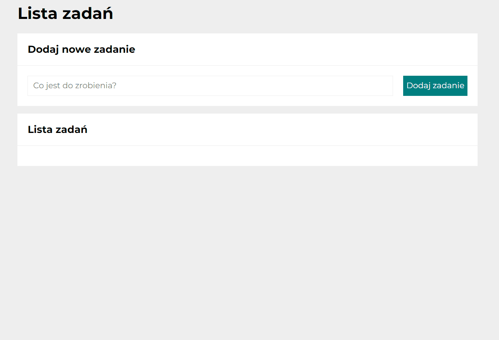

# *To do list*
This repository presents **handy check list**.

## Demo
https://ulczik.github.io/toDoList/

## Descripttion
Now you wont forget what you have to do with this simple tasks list.

You may easily:
1. Add new tasks
2. Mark as done
3. Remove done tasks

Below is instruction how to use this application.

## Used technologies
- HTML
- CSS
- BEM convention
- JavaScript ES6+	

## Features
- Grid & flex layouts
- Media queries
